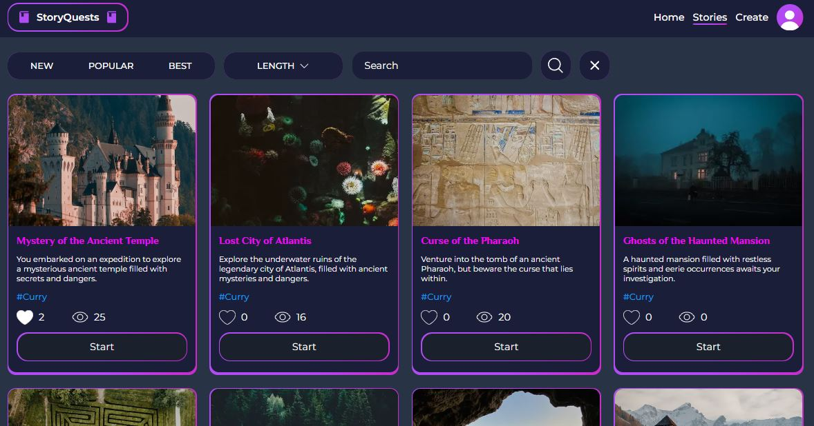

### StoryQuests - сайт с текстовыми квестами

Демо: https://story-quests.vercel.app/

Сайт с возможностью проходить текстовые квесты и создавать свои.
Создание квеста происходит при помощи редактирования диаграммы сцен.
Реализована упрощенная JWT-авторизация при помощи cookie.

Разработан по архитектуре Feature-Sliced Design

<picture>
 
</picture>

Дизайн в Figma: https://www.figma.com/design/W5rezutScyASFYWBLd0Nwp
Бекенд: https://github.com/IvanZemsky/story-quests-backend

### Стек технологий:
+ React 18 (TypeScript)
+ Next 15
+ MobX
+ SCSS (modules)
+ React Query
+ Axios
+ React Flow
+ React Hook Form
+ React Transition Group
+ Zod